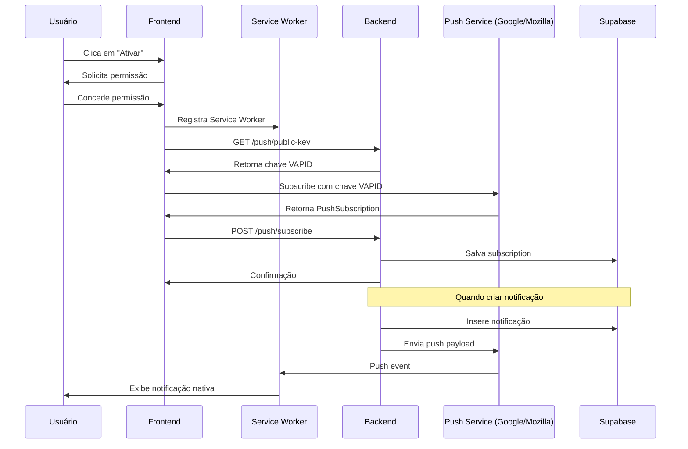

# 🔔 Guia de Notificações Push - Sistema de Ponto Eletrônico

## 📋 Sumário Executivo

Sistema completo de notificações push implementado com Web Push API, permitindo que usuários recebam alertas em tempo real mesmo com o navegador fechado.

---

## ✅ Funcionalidades Implementadas

### Backend (NestJS)

1. **PushModule** (`src/push/`)

   - `push.module.ts` - Módulo de notificações push
   - `push.service.ts` - Lógica de negócio e integração com web-push
   - `push.controller.ts` - Endpoints REST

2. **Endpoints disponíveis**:

   - `GET /api/push/public-key` - Retorna chave pública VAPID
   - `POST /api/push/subscribe` - Registra subscription do usuário
   - `DELETE /api/push/unsubscribe/:userId` - Remove subscription
   - `POST /api/push/test/:userId` - Envia notificação de teste

3. **Integração automática**:
   - NotificationsService envia push automaticamente ao criar notificação
   - Subscriptions salvas no Supabase (tabela `push_subscriptions`)
   - Limpeza automática de subscriptions expiradas

### Frontend (React + Vite)

1. **Service Worker** (`public/service-worker.js`)

   - Intercepta eventos de push
   - Exibe notificações nativas do sistema
   - Gerencia cliques em notificações

2. **Hook customizado** (`src/hooks/usePushNotifications.ts`)

   - Gerencia permissões
   - Registra/cancela subscriptions
   - Estado reativo da subscription

3. **Componente UI** (`src/components/PushNotificationSettings.tsx`)

   - Interface amigável para ativar/desativar
   - Botão de teste
   - Indicadores de status
   - Mensagens de erro/sucesso

4. **Integração na página de Perfil**
   - Seção dedicada para configuração de notificações
   - Acessível em `/funcionario/perfil`

---

## 🚀 Como Usar

### 1. Configurar Backend

#### a) Executar SQL no Supabase

Acesse o SQL Editor do Supabase e execute:

```sql
-- Criar tabela de subscriptions
CREATE TABLE IF NOT EXISTS push_subscriptions (
  id UUID DEFAULT gen_random_uuid() PRIMARY KEY,
  user_id UUID NOT NULL REFERENCES auth.users(id) ON DELETE CASCADE,
  endpoint TEXT NOT NULL,
  p256dh TEXT NOT NULL,
  auth TEXT NOT NULL,
  expiration_time BIGINT,
  created_at TIMESTAMP WITH TIME ZONE DEFAULT NOW(),
  updated_at TIMESTAMP WITH TIME ZONE DEFAULT NOW(),

  UNIQUE(user_id, endpoint)
);

CREATE INDEX idx_push_subscriptions_user_id ON push_subscriptions(user_id);
CREATE INDEX idx_push_subscriptions_endpoint ON push_subscriptions(endpoint);
```

#### b) Verificar .env

O arquivo `meu-saas-backend/.env` já contém as chaves VAPID geradas:

```env
VAPID_PUBLIC_KEY=BH2UfJPq2fNY0efIhUHa5x7ozSZlr-nI7bd8XY2A5Ezfd2eN3k1RG36aD2JgRUa_WmbB4i_NS0GD079VHWA_PK8
VAPID_PRIVATE_KEY=QSL-98Geq0r2oTlR-mgMS3kqdahtSEV_MB7HnSwRauw
VAPID_SUBJECT=mailto:admin@prefeitura.com
```

#### c) Reiniciar Backend

```powershell
cd meu-saas-backend
npm run dev
```

### 2. Usar no Frontend

#### a) Acessar Perfil

1. Faça login como funcionário
2. Acesse **Perfil** no menu lateral
3. Role até a seção **"Notificações Push"**

#### b) Ativar Notificações

1. Clique em **"Ativar"**
2. Permita notificações quando o navegador solicitar
3. Aguarde confirmação de sucesso

#### c) Testar Notificação

1. Clique em **"🔔 Testar Notificação"**
2. Você deve receber uma notificação do sistema
3. Clique na notificação para abrir o sistema

---

## 🔧 Arquitetura Técnica

### Fluxo de Funcionamento



### Componentes Principais

#### 1. PushService (Backend)

```typescript
// Principais métodos
-subscribe(userId, subscription) - // Registra
  unsubscribe(userId, endpoint) - // Remove
  sendToUser(userId, payload) - // Envia push
  getPublicKey(); // Retorna VAPID public key
```

#### 2. usePushNotifications (Frontend)

```typescript
// Estado retornado
{
  supported: boolean,        // Navegador suporta?
  permission: NotificationPermission, // 'granted' | 'denied' | 'default'
  subscription: PushSubscription | null,
  loading: boolean,
  error: string | null
}

// Métodos
- requestPermission()  // Solicita permissão
- subscribe()          // Cria subscription
- unsubscribe()        // Remove subscription
```

---

## 📱 Navegadores Suportados

| Navegador | Desktop | Mobile   | Notas                |
| --------- | ------- | -------- | -------------------- |
| Chrome    | ✅ 50+  | ✅ 42+   | Totalmente suportado |
| Firefox   | ✅ 44+  | ✅ 48+   | Totalmente suportado |
| Edge      | ✅ 17+  | ✅ 17+   | Totalmente suportado |
| Safari    | ✅ 16+  | ✅ 16.4+ | Requer iOS 16.4+     |
| Opera     | ✅ 37+  | ✅ 37+   | Totalmente suportado |

---

## 🔐 Segurança

### Chaves VAPID

- **Públicas**: Compartilhadas com o frontend
- **Privadas**: Mantidas secretas no backend (.env)
- **Subject**: Email de contato do administrador

### Autenticação

- Subscriptions vinculadas ao `user_id` do Supabase
- Tokens de auth verificados em cada endpoint
- CORS configurado para origens permitidas

### Privacidade

- Usuários controlam permissões
- Dados criptografados fim-a-fim pelo navegador
- Subscriptions removidas ao revogar permissão

---

## 🧪 Testes

### 1. Teste Manual

```typescript
// No frontend (console do navegador)
await apiService.testPushNotification(currentUser.id);
```

### 2. Teste via API

```bash
# PowerShell
Invoke-WebRequest -Uri "http://localhost:3000/api/push/test/USER_ID_AQUI" `
  -Method POST `
  -Headers @{"Authorization"="Bearer SEU_TOKEN"}
```

### 3. Testar Service Worker

```javascript
// Console do navegador
navigator.serviceWorker.ready.then((registration) => {
  console.log("Service Worker ativo:", registration.active);
});
```

---

## 🐛 Troubleshooting

### Problema: "Notificações não suportadas"

**Causa**: Navegador antigo ou HTTP (não HTTPS)

**Solução**:

- Use navegador moderno (Chrome 50+, Firefox 44+)
- Em desenvolvimento: `localhost` é permitido
- Em produção: Use HTTPS obrigatoriamente

---

### Problema: "Permissão negada"

**Causa**: Usuário bloqueou notificações

**Solução**:

1. Chrome: `chrome://settings/content/notifications`
2. Firefox: Clicar no cadeado → Permissões → Notificações
3. Safari: Preferências → Sites → Notificações
4. Recarregar a página após permitir

---

### Problema: "Subscription expirou"

**Causa**: Subscription automática expirada pelo navegador

**Solução**:

- O sistema remove automaticamente subscriptions inválidas
- Usuário deve reativar notificações manualmente

---

### Problema: "Service Worker não registra"

**Causa**: Caminho incorreto ou erro no SW

**Solução**:

```javascript
// Verificar console do navegador
navigator.serviceWorker.getRegistrations().then((registrations) => {
  console.log("Service Workers:", registrations);
});

// Forçar re-registro
navigator.serviceWorker
  .getRegistrations()
  .then((registrations) => {
    registrations.forEach((r) => r.unregister());
  })
  .then(() => location.reload());
```

---

## 📊 Monitoramento

### Verificar Subscriptions Ativas

```sql
-- Supabase SQL Editor
SELECT
  ps.id,
  ps.user_id,
  u.email,
  ps.created_at,
  ps.updated_at
FROM push_subscriptions ps
JOIN auth.users u ON u.id = ps.user_id
ORDER BY ps.created_at DESC;
```

### Logs do Backend

```bash
# Logs do NestJS mostram:
[PushService] VAPID configurado com sucesso
[PushService] Subscription registrada para usuário abc-123
[PushService] Push enviado com sucesso para abc-123
[PushService] Subscription expirada/inválida, removendo...
```

---

## 🎯 Casos de Uso

### 1. Aprovação de Ponto

```typescript
// Backend: time-records.service.ts
await this.notificationsService.createNotification({
  userId: record.user_id,
  title: "Ponto Aprovado",
  message: `Seu registro de ${date} foi aprovado`,
  type: "SUCCESS",
  actionUrl: "/funcionario/historico",
});
// Push enviado automaticamente ✅
```

### 2. Rejeição de Ponto

```typescript
await this.notificationsService.createNotification({
  userId: record.user_id,
  title: "Ponto Rejeitado",
  message: `Registro de ${date} rejeitado: ${reason}`,
  type: "WARNING",
  actionUrl: "/funcionario/historico",
});
// Push enviado automaticamente ✅
```

### 3. Lembrete de Ponto

```typescript
// Pode ser agendado com cron job
await this.notificationsService.createNotification({
  userId,
  title: "Lembrete de Ponto",
  message: "Não se esqueça de registrar seu ponto de saída!",
  type: "INFO",
  actionUrl: "/funcionario/ponto",
});
// Push enviado automaticamente ✅
```

---

## 🔄 Próximas Melhorias

- [ ] Notificações silenciosas (background sync)
- [ ] Agrupamento de notificações
- [ ] Rich notifications com imagens
- [ ] Ações rápidas nas notificações
- [ ] Estatísticas de entrega
- [ ] Rate limiting por usuário

---

## 📚 Referências

- [Web Push API - MDN](https://developer.mozilla.org/en-US/docs/Web/API/Push_API)
- [Service Worker - MDN](https://developer.mozilla.org/en-US/docs/Web/API/Service_Worker_API)
- [VAPID - RFC 8292](https://datatracker.ietf.org/doc/html/rfc8292)
- [web-push library](https://github.com/web-push-libs/web-push)

---

## ✅ Checklist de Implementação

- [x] Backend: PushModule criado
- [x] Backend: Endpoints de push implementados
- [x] Backend: Integração com NotificationsService
- [x] Backend: Chaves VAPID geradas
- [x] Frontend: Service Worker criado
- [x] Frontend: Hook usePushNotifications
- [x] Frontend: Componente de configuração
- [x] Frontend: Integrado na página de Perfil
- [x] Banco de dados: Tabela push_subscriptions
- [x] Documentação completa

**Status**: ✅ **FASE 5 COMPLETA!**
